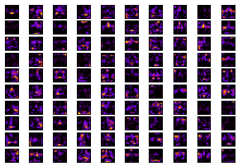

# nonnegative_matrix_factorization
NMF implementation based on Lee and Seung's multiplicative rules[[1]].

Basically given X, a nonnegative matrix. X is factorized into W * H , with a certain number of features, K. 

[1]: https://proceedings.neurips.cc/paper_files/paper/2000/file/f9d1152547c0bde01830b7e8bd60024c-Paper.pdf